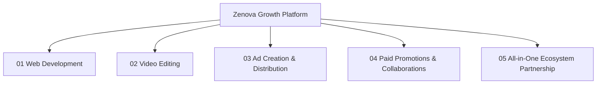

# Zenova Service Ecosystem Skill Guide

This skill defines the technical, visual, and narrative structure for Zenova's core service offerings and all-in-one growth solutions.

---

## 1. The 4 Core Service Verticals & All-in-One Combination

---

## 2. Service Domain Mapping & Specs

### 1. Web Development (`src/pages/services/WebDevelopment/`)
* **Core Value**: *"Websites That Work. Experiences That Convert."*
* **Target Audience**: Startups, e-commerce brands, SaaS companies needing high-speed, secure, conversion-focused websites.
* **Design Structure**:
  * Hero chapter with 3D Laptop pedestal render.
  * Brand trust bar (`nova`, `PULSE`, `Horizon`, `craftly`, `ledger`, `visionx`).
  * 4 Core Capabilities (`Custom Websites`, `Web Applications`, `E-Commerce Solutions`, `Performance Optimized`).
  * Selected Projects Grid (`Fintech Platform`, `E-Commerce Storefront`, `Creative Agency Web App`).
  * Tech Stack Grid (`React`, `Next.js`, `TypeScript`, `Node.js`, `Tailwind CSS`, `MongoDB`, `PostgreSQL`, `AWS`, `Vercel`, `Git`, `Docker`, `Figma`).
  * Client Testimonials & Lead Capture Form.
* **Image Asset**: `/media/cap_web_laptop.jpg`

### 2. Video Editing (`src/pages/services/VideoEditing/`)
* **Core Value**: *"Stories That Engage. Edits That Inspire."*
* **Target Audience**: Content creators, brands, marketing teams needing cinematic documentaries, commercial ads, and short-form reels.
* **Design Structure**:
  * Hero chapter with 3D Studio Camera render.
  * Showreel video player.
  * 4 Core Capabilities (`Cinematic Storytelling`, `Short-form & Reels`, `Color Grading`, `Sound Design`).
  * Project Grid (`Brand Film`, `Product Experience Video`).
  * Workflow Steps & Booking Form.
* **Image Asset**: `/media/camera_studio_3d.jpg`

### 3. Ad Creation & Distribution (`src/pages/services/AdCreation/`)
* **Core Value**: *"Create. Publish. Promote. All in One Place."*
* **Target Audience**: D2C brands, B2B services, app developers running paid acquisition campaigns on Meta, Google, & TikTok.
* **Design Structure**:
  * Hero chapter with 3D Smartphone app mockup render.
  * 4 Core Capabilities (`Ad Video Creation`, `Meta Ads`, `Campaign Management`, `Performance Tracking`).
  * Analytics Metric Cards (`128K Instagram Reach`, `215K Facebook Reach`, `3.2K Conversions`).
* **Image Asset**: `/media/cap_ads_phone.jpg`

### 4. Paid Promotions & Collaborations (`src/pages/services/PaidPromotions/`)
* **Core Value**: *"Right Creators. Real Impact."*
* **Target Audience**: Consumer brands looking for influencer partnerships, creator whitelisting, and viral promotional distribution.
* **Design Structure**:
  * Hero chapter with 3D Megaphone render & floating social icons.
  * 4 Core Capabilities (`Influencer Research`, `Campaign Management`, `Content Approval`, `Performance Tracking`).
  * Collab Cards (`Fashion Brand x Creator`, `Skincare Brand x Influencer`).
* **Image Asset**: `/media/cap_promo_megaphone.jpg`

### 5. All-in-One Ecosystem Partnership
* **Core Value**: *"Ideas that Build Brands. Systems that Drive Growth."*
* **Target Audience**: Ambitious businesses seeking an end-to-end digital partner covering web engineering, content creation, ad distribution, and creator promotions combined into a unified growth engine.
* **Design Structure**: The editorial narrative homepage (`LandingPage.tsx`), interconnecting all 4 service chapters into one seamless story leading to the `LET'S MAKE IT REAL` contact form.

---

## 3. Section Imagery Mapping Table

| Section Name | Required Image Asset | Visual Concept | Location |
| :--- | :--- | :--- | :--- |
| Hero Chapter | `/media/hero_lavender_landscape.jpg` | 3D lavender field with metallic coins | Hero Right |
| Web Dev Capability | `/media/cap_web_laptop.jpg` | 3D laptop open on lavender pedestal | Section 01 |
| Video Editing Capability | `/media/camera_studio_3d.jpg` | 3D cinema video camera on tripod | Section 03 |
| Ad Creation Capability | `/media/cap_ads_phone.jpg` | 3D smartphone displaying social app | Section 04 |
| Paid Promotions | `/media/cap_promo_megaphone.jpg` | 3D metallic megaphone with social icons | Section 05 |
| Contact Section | `/media/contact_lavender_vase.jpg` | 3D lavender glass vase with stems | Contact Left |
| Step 01 Understand | `/media/photo_understand_dev.jpg` | Developer working thoughtfully on laptop | Approach Step 01 |
| Step 02 Plan | `/media/photo_sketch_wireframe.jpg` | Designer sketching wireframes on paper | Approach Step 02 |
| Step 03 Create | `/media/photo_create_ui.jpg` | Monitor displaying clean UI design | Approach Step 03 |
| Step 04 Launch | `/media/photo_launch_review.jpg` | Team reviewing code on monitor | Approach Step 04 |
| Step 05 Evolve | `/media/photo_evolve_plant.jpg` | Indoor plant casting soft sun shadows | Approach Step 05 |
